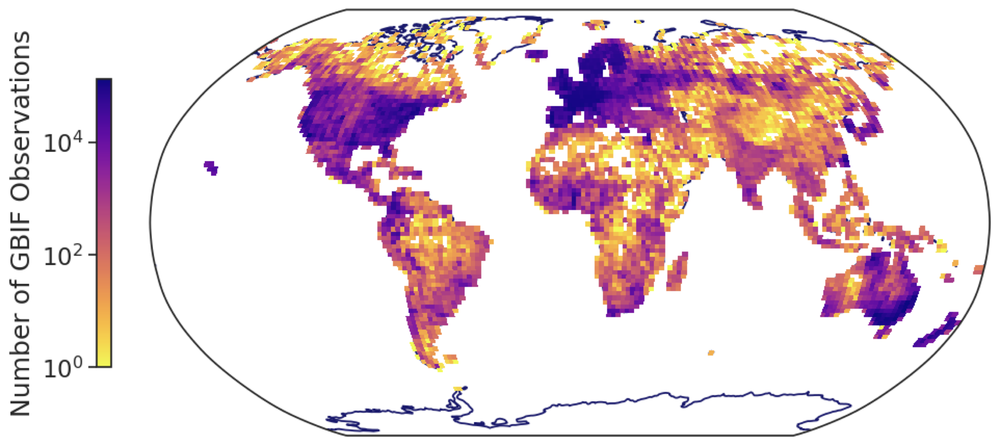

# Trait maps based on sample of GBIF database

## Trait maps

Here you will find trait maps based on GBIF data and traits found in the TRY gap-filled dataset in GeoTIFF format at a 0.2°, 0.5°, and 2° resolutions. Each folder also contains the sPlotOpen maps for all respective traits and resolutions.

## Data

Source of species observations are GBIF sampled as such:
  1. GBIF download: https://doi.org/10.15468/dl.fe2kv3
  2. The observations were then linked to the TRY gap-filled dataset, which resulted in a total of n= observations. 90% of the GBIF observations were matched, 70% of species in TRY, and 24% of species in GBIF
  3. Matched observations were then binned into equal area hexagons (using the package size hex9, which corresponds to about 0.5 degrees at equator)
  4. From each hexagon were then sampled 10,000 observations. If a hexagon contained less than 10,000 observations, all observations were kept.
  5. This GBIF subsample contained approx. 35,000,000 observations

Figure 1: Global density of GBIF subsample at 2° resolution.

## Traits in TRY gap-filled:

|  TRY trait ID |  Trait name |
|---|---|
|  169 | Stem conduit density (vessels and tracheids)  |  
|  78 | Leaf nitrogen (N) isotope signature (delta 15N).  |   
|  55 |  Leaf dry mass (single leaf) |  
|  3113 | Leaf area (in case of compound leaves: leaflet, undefined if petiole is in- or excluded)  |  
|  3114 |  Leaf area (in case of compound leaves undefined if leaf or leaflet, undefined if petiole is in- or excluded) |  
|  163 | Leaf fresh mass  |  
|  3112 | Leaf area (in case of compound leaves: leaf, undefined if petiole in- or excluded)  |  
|  145 | Leaf width |  
|  6 |  Root rooting depth |  
|  18 |  Plant height  |  
|  26 | Seed dry mass |  
|  4 |  Stem specific density (SSD) or wood density (stem dry mass per stem fresh volume) |  
|  15 | Leaf phosphorus (P) content per leaf dry mass  |  
|  144 | Leaf length  |  
|  50 | Leaf nitrogen (N) content per leaf area  |  
|  27 |  Seed length |  
|  11 | Leaf area per leaf dry mass (specific leaf area, SLA or 1/LMA)  |  
|  21 | Stem diameter  |  
|  1080 | Root length per root dry mass (specific root length, SRL)  |  
|  289 | Wood fiber lengths  |  
|  146 | Leaf carbon/nitrogen (C/N) ratio|  
|  223 | Species genotype: chromosome number  |  
|  46 |  Leaf thickness  |
|  237 | Dispersal unit length  |  
|  14 |  Leaf nitrogen (N) content per leaf dry mass |  
|  282 | Wood vessel element length; stem conduit (vessel and tracheids) element length |  
|  3120 | Leaf water content per leaf dry mass (not saturated)  |  
|  47 |  Leaf dry mass per leaf fresh mass (leaf dry matter content, LDMC)|  
|  13 | Leaf carbon (C) content per leaf dry mass  |  
|  138 |  Seed number per reproducton unit |  
|  281 |  Stem conduit diameter (vessels, tracheids) |  
|  224 |  Species genotype: chromosome cDNA content |  
|  95 |  Seed germination rate (germination efficiency) |  

Stem conduit density
DeltaN15
Leaf dry mass
Leaf area (3113, 3114, 3112)
Leaf fresh mass
Leaf width

Rooting depth

Plant height (18)
Seed dry mass
SSD
Leaf P per leaf dry mass
Leaf length
Leaf N per area
Seed length
SLA
Stem diameter

Root length per root dry mass
Leaf water content per leaf dry mass
LDMC

## Correlation of sPlotOpen and GBIF sample for all traits at different resolutions

